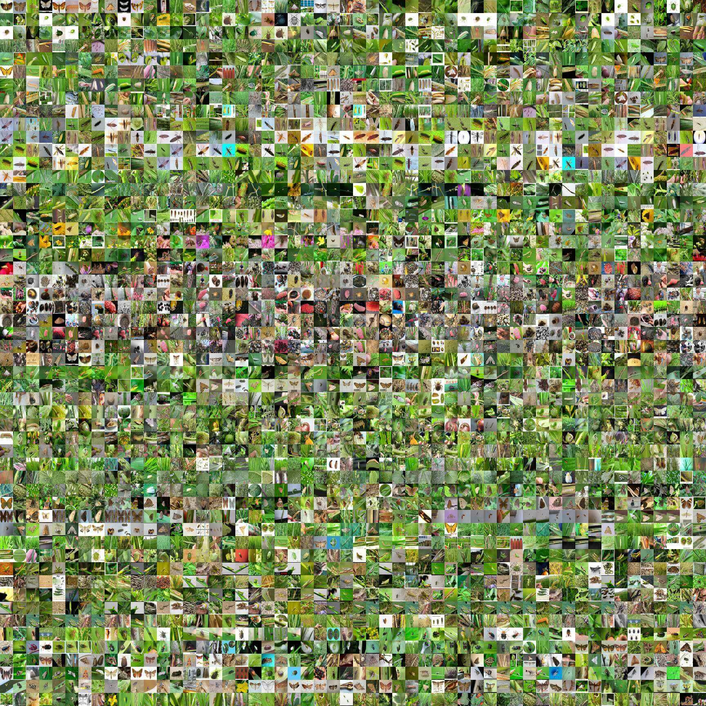

```
               ######        ###       ##     ##    ########    ########     ######   
              ##    ##      ## ##      ##     ##       ##       ##          ##    ##  
              ##           ##   ##     ##     ##       ##       ##          ##        
               ######     ##     ##    ##     ##       ##       ######      ##   #### 
                    ##    #########    ##     ##       ##       ##          ##    ##  
              ##    ##    ##     ##    ##     ##       ##       ##          ##    ##  
               ######     ##     ##     #######        ##       ########     ######  

```

# SAUTAG 中文文档


>数据集图片展示

## 项目说明

&emsp;&emsp;SAUTEG为公开化农业病虫害图像数据集，项目旨在提供一个公开化的农业病虫害图像数据集收集平台。

## 使用说明

使用项目前应先了解数据集文件结构

### 目录结构

```
//涉及的作物种类名、虫害名、病害名应该优先使用拉丁学名
SATEG
├─Oryza sativa L        //涉及作物种类的拉丁学名
│  ├─Diseases           //此文件夹用于存放该作物的病害数据集
│  │  ├─!Phytophthora fragariae Hickm.var.oryzo-bladis Wang et Lu    //当样本数量过少应在样本前加"!"符号
│  │  ├─Entyloma oryzae Syd
│  │  └─Fusarium moniliforme Sheld
│  └─Pests             //此文件夹用于存放该作物的虫害数据集
│      ├─!Ancyllomia japonica zeller
│      ├─Aleurocybotus indicus David et Subramaniam
│      ├─Ampullaria gigas Spix
└─Sample               //此文件夹用于存放优化后的病虫害训练样本（可快速用于训练模型）
   └─Oryza sativa L.Pests     //其中的一个训练样本,分号分割作物种类和样本类型(这里代表该优化训练样本为Oryza sativa L的Pests)
        ├─test                //这里是测试数据集文件夹
        │  ├─Aleurocybotus indicus David et Subramaniam
        │  └─Ampullaria gigas Spix
        |─train               //这里是训练数据集文件夹
        |   ├─Aleurocybotus indicus David et Subramaniam
        |   └─Ampullaria gigas Spix
        └─README             //该训练样本的说明文档，当对数据集进行特殊处理后（例如改变了默认的训练样本文档目录结构），应在这里进行说明
                              
```

+ 涉及的作物种类名、虫害名、病害名为**拉丁学名**
+ 文件夹名前`!`代表样本数量过少<br>
例如:<br>
`!Phytophthora fragariae Hickm.var.oryzo-bladis Wang et Lu //该样本数量不足`
+ 根目录下作物拉丁学名的文件夹包含该作物的原始数据，内有`Diseases`存放病害数据和`Pets`存放虫害数据
+ `Diseases`和`Pets`文件夹内的数据应以拉丁学名为文件夹分类存储
+ 文件夹名的`&`连接不同种类数据,里面存取的是相似的病害和虫害<br>
例如:<br>
`Cletus punctiger&Clketus trigonus //该文件夹存有两种相识虫害`
>在使用该方式时,种类有极大相似性,在防治角度没有分开的必要性

+ 部分文件夹拉丁学名超过**GitHub最大长度**时,使用了首字母缩写格式,在对应根目录有`README`文件进行了说明<br>
例如:<br>
`H.S.2F.M为5种相识种类合并后导致的文件夹名过长,使用缩写形式,在根目录建立`README`文件进行说明`
+ `Sample`文件夹存储可以直接可以用于训练的样本，样本文件夹名采用`作物名.类别`的命名方式
+ 样本文件夹根目录可能有`README`文件，对数据集进行进行说明

### 快速上手

#### 极速开始

&emsp;&emsp;如果你想快速搭建你的识别模型,只需按需在`Sample`文件夹找到预先设计过数据集,数据集已按照`作物名.类别`的命名方式对样本的数据类型说明。（文件夹中可能有`README`文件对样本详细情况进行说明）

#### 原始数据

&emsp;&emsp;原始数据在数据集根目录下以作物拉丁学名为文件夹存放，内有`Diseases文件夹`存放病害数据和`Pets文件夹`存放虫害数据。


## 版本更新

### version_1.0

+ 更新了水稻病虫害;
+ 在`Sample`文件夹加入了Oryza sativa L.Pests训练样本。

## 上传须知

你可以对项目数据进行上传和修改，完善数据集、上传你的数据集或你精心设计过的训练样本。

上传需**按照目录结构要求**并**遵守以下规则**:
1. 涉及的作物种类名、虫害名、病害名应该优先使用**拉丁学名**
2. 样本数量过少应在样本文件夹前加`!`符号<br>
例如:<br>
`!Phytophthora fragariae Hickm.var.oryzo-bladis Wang et Lu //该样本数量不足`
3. 根目录下作物拉丁学名的文件夹应包含该作物的原始数据，内有`Diseases`存放病害数据和`Pets`存放虫害数据
 `Diseases`和`Pets`文件夹内的数据应以拉丁学名为文件夹分类存储
4. 可以使用一个文件夹存取几种相似的病害和虫害,不同种类拉丁学名应用`&`分割<br>
例如:<br>
`Cletus punctiger&Clketus trigonus //该文件夹存有两种相识虫害`

>在使用该方式时,应保证种类应有极大相似性,在防治角度没有分开的必要性

5. 当文件夹拉丁学名超过**GitHub最大长度**时,可以使用首字母缩写格式,应在对应根目录建立`README`文件进行说明<br>
例如:<br>
`H.S.2F.M为5种相识种类合并后导致的文件夹名过长,使用缩写形式,在根目录建立`README`文件进行说明`
6. `Sample`文件夹存储可以直接可以用于训练的样本，样本文件夹名采用“作物名.类别”的命名方式
7. 样本文件夹根目录可建立`README`文件，对数据集进行进行说明

>例如改变了默认的训练样本文档目录结构或采用了特殊的数据集处理方式

## 版权说明

&emsp;&emsp;SAUTEG旨在提供一个公开化的农业病虫害图像数据集收集平台。项目数据集图片版权归原作者,如有侵权请联系我们删除。本项目数据仅供研究等非商业用途，不承担任何组织和个人商用导致侵权的法律责任。